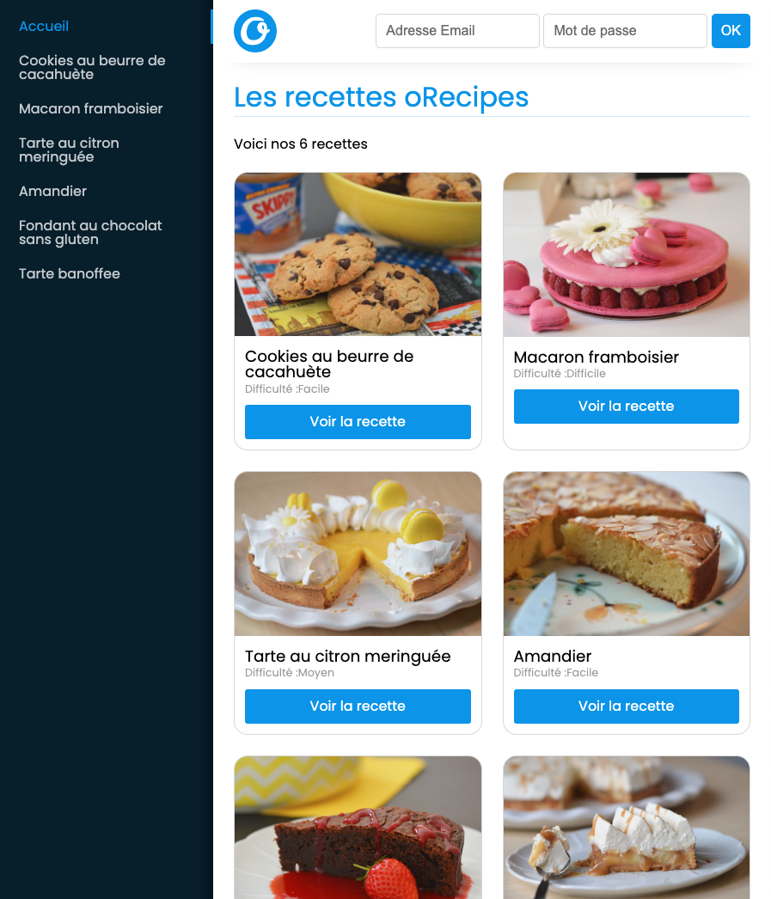
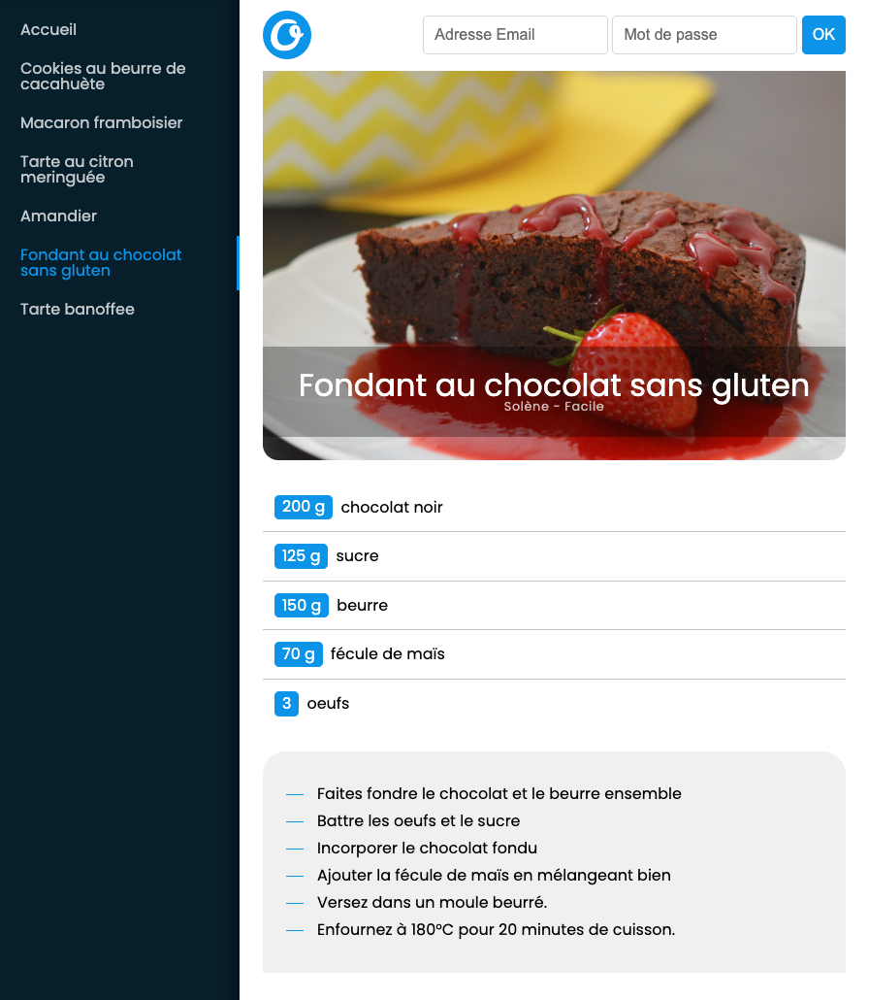
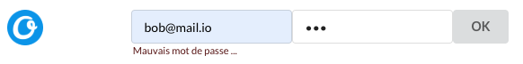
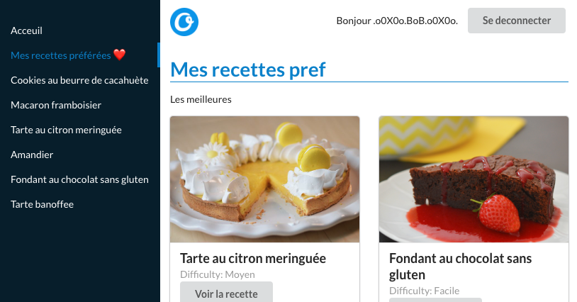

# Challenge atelier O'Recipes

**Objectif de la journée** : réaliser une interface front en React qui affiche des recettes. 💪

## 1. Création du projet

- Créez un nouveau projet React avec Vite (appelez le S19-orecipes-front-votrePseudoGithub).

- Config linter formatter 
  - Supprimez Eslint 
  - [Installez Biome](https://github.com/O-clock-Skaven/S19-LocalExpress/blob/main/__docs/cours-recaps/03-biome.md).

- Git 
  - Initialisez un **repo git local**.
  - Créez un nouveau **repo git distant** sur github (du même nom).
    - Ajoutez votre binome en admin dessus (Settings > Collaborator and teams > Add people)
  - Branchez votre repo local avec ce nouveau distant.
  - Pensez à commit+push votre code régulièrement ;)

## 2. Structure statique de composants

**Objectif** : Créez la structure de la page d'acceuil en découpant avec les composants qui vous semblent pertinents.

Vous pouvez vous inspirer de la maquette suivante :

Pour commencer, vous pouvez afficher juste 1 ou 2 cartes recettes avec des données en dur. Vous allez dynamiser ensuite avec les données de l'API.

### Style 🎨

Pour le style, vous pouvez utiliser CSS, [SASS](https://sass-lang.com/), [tailwind](https://tailwindcss.com/) ou une bibliothèque de composants pré-stylés comme [SemanticUI React](https://react.semantic-ui.com/).
Dans tous les cas le style n'est pas imposé, n'y passez pas 2h mais faites en sorte d'avoir un site avec une présentation sympa qui vous plait.

Vous pouvez récuperer le logo dans le dossier `front_docs/` de ce repo.

## 3. Recettes de l'API

**Objectif** : afficher les recettes de l'API.

Le code est l'API est dispo dans ce repo, par curiosité vous pouvez regarder le code dans le dossier `back_api` mais cette API est hebergée et tourne sur un serveur onRender ici : https://orecipesapi.onrender.com/. **Vous n'avez donc pas besoin de la lancer en local !**.  

L'API est documentée avec un Swagger qui vous permet de tester les requêtes directement dans le navigateur.

- Mettez en place un state qui permet d'accueillir la liste des recettes.
- N'oubliez pas de [typer ce state](https://github.com/O-clock-Skaven/S19-LocalExpress/blob/main/__docs/cours-recaps/04-typescript.md#typer-ce-que-nous-renvoie-usestate) pour qu'il puisse acceuillir un tableau d'objet recette meme si vous l'initialisez avec un tableau vide.
- Après le premier rendu de votre app, fetchez les données et enregistrez les dans le state.
- Utilisez les données du state pour dynamiser :
  - les cartes recettes 
  - les liens recettes du menu 
  (à chaque fois, utilisez map sur le tableau du state pour créer un tableau d'elements dans votre JSX)

#### BONUS

- Mettez en place un loader qui sera affiché tant que les recettes ne sont pas encore dans le state.

## 4. Router et page recette

**Objectif** : au click sur un lien recette, afficher une page avec les détails de la recette (ingrédients et instructions)

Pour la page recette vous pouvez vous inspirer de la maquette suivante :

Il vous faudra créer un routeur à l'aide de [react-router-dom](https://reactrouter.com/en/main). Servez-vous de la fiche récap sur react-router-dom et sur ce qui a été vu en s15-16 !

- Installez `react-router-dom`
- Mettez en place le `<BrowserRouter>`
- Remplacez tous les liens `<a>` par des `<Link>` ou `<NavLink>`
- Créez vos routes :
  - page d'acceuil avec toutes les cartes recettes
  - page recette avec les détails de la recette dont le slug sera dans l'URL (il faudra créer une route dynamique, elle doit matcher quelque soit le slug)
- Créez le composant pour cette page recette, dans ce composant pour récupérer le slug de l'URL vous devrez utiliser la fonction `useParams` de react-router-dom.

#### BONUS

- Vous remarquez que si on scrolle un peu puis on change de page, on reste scrollé ! Normal, on n'a pas réélement changé de page ... donc faites en sorte qu'à chaque changement de page le scroll revienne à zéro. 

  Indice : *Utilisez la fonction `scrollTo` sur l'objet window, attention le scroll de la fenetre de navigateur est considéré comme un effet de bord ;)*

## 5. Login Form

**Objectif** : Quand l'utilisateur valide le formulaire de login, on veut envoyer une requête au back pour vérifier ses credentials (email+password) et lui afficher un message d'erreur si ils ne sont pas bons.

- Au submit du formulaire envoyez une requête POST vers le end point `https://orecipesapi.onrender.com/api/login/` avec les identifiants saisis par l'utilisateur.  
A vous de choisir [comment récuperer les saisies utilisateur](https://github.com/O-clock-Pavlova/S15-16-react-recaps-SoleneOclock/blob/main/E04-formulaires.md).
- En fonction de la réponse du backend : 
  - Si vous recevez une erreur, enregistrez un message d'erreur "Mauvais mot de passe ou email" dans un state local et affichez le sur la page.
  - Si vous recevez une 200 avec un pseudo et un JWT, on va stocker tout ça dans un store à l'étape suivante !

## 6. Stockage du user connecté dans un store

**Objectif** : Après s'être logué on veut que le user reste authentifié et qu'il ai un message de bienvenue et bouton de deconnexion. On va stocker le user et son JWT dans le state d'un store Zustand.

Vous pouvez vous aider de ce que vous avez fait en S16 : [atelier-jwt-avec-react-et-node-YannickOclock](https://github.com/O-clock-skaven/atelier-jwt-avec-react-et-node-YannickOclock)

- Installez Zustand
  
- Créez un store avec :
  - un `user` initilisée à `null`   
    *Pensez à typer correctement cette propriété car elle contiendra après authentification le pseudo et le jwt, elle peut donc etre soit nulle, soit un objet*

  - une fonction `login` qui prend en paramètre un pseudo et un token et les enregistre dans le state du store  
    *➡️ cette fonction sera executée quand le user est logué*

  - une fonction `logout` qui supprime le pseudo et le token du state du store  
    *➡️ cette fonction sera executée quand le user se deconnecte*

- Dans le composant qui affiche le formulaire de login, récuperez le `user` du store et utilisez sa valeur pour conditionner votre affichage : 
  - si le user est null on affiche le formulaire de login
  - si le user contient un pseudo et un JWT on affiche un message "Bonjour pseudo" et un bouton de deconnexion

- Si la requete de check des credential codée à l'étape précédente renvoie une 200, executez la fonction login du store pour enregistrer le token et le pseudo reçu dans le state du store
- Au click sur le bouton de deconnexion, executez la fonction logout du store zustand

## 7. Page recette préférées

**Objectif**: Si l'utilisateur est connecté il doit voir un lien vers une page "Mes recettes préférée". Cette page va afficher les recettes préférées de l'utilisateur, pour les récuperer il faut interoger un endpoint privé.

  - Dans le composant qui affiche les liens du menu, récuperez le user du state du store Zustand. Si le user n'est pas null, ajoutez un lien "Mes recettes pref" qui va vers l'url `/my-favorites` dans le menu.

  - Même chose dans le composant qui affiche les Routes, si le user n'est pas null, ajoutez une route qui pour l'url `/my-favorites` affiche un composant `<FavoritesRecipes>`

  - Codez ce composant FavoritesRecipes. Vous pouvez copier coller un peu le composant qui affiche toutes les cartes recettes sauf que la requete qui recupère les recettes ne sera pas la même. Il faut interogger l'URL `/api/favorites`, c'est un endpoint privé donc il faut ajouter le JWT dans les entetes de la requete.

## 8. Bonus : déployez votre projet

- Mettez en place une chaine de déploiement automatisée avec githuAction pour déployer votre projet sur surge.

## Si vous avez tout fini : Bravo 🔥🔥🔥
